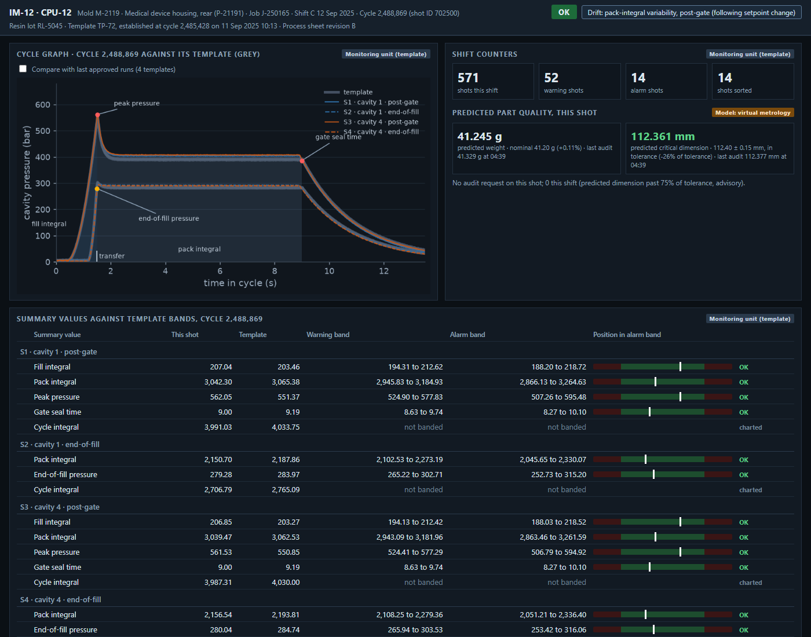

# Cavity Pressure Monitoring and Predictive Quality

**A data platform, SPC layer and three model components for an injection molder's instrumented cell: every shot retained, charted, measured and screened for the unexpected.**

An injection molder runs two presses, IM-11 and IM-12, with cavity pressure sensors in six molds: automotive connector housings, medical device housings, a trim clip and a fluid-handling manifold. Each press has a monitoring unit that compares every shot's curve to a template and sorts shots that leave their bands. The shop's quality program ran on top of that: first-shot approvals, hourly audits with control charts, a reject bin reviewed each shift and scrap tallied by code at packing.

What the shop lacked was the connection. The units kept per-shot values for about 60 days and curves for about 10, nothing joined them to the MES job, the resin lot, the setpoint log or the audits, and the control-chart rules ran on one audit sample an hour.

[](docs/reports/unit_screen.html)

> **[All deliverables &rarr;](docs/index.html)**

---

## What was built

1. **Data pipeline.** Fifteen months of the units' per-shot summaries (about 2.9 million sensor rows), a retained sample of curves at 100 readings per second (about 600 million rows), machine-side shot data from the presses, and the MES, ERP, QMS, materials, dryer and tool-room records, landed as Parquet and CSV and modeled in dbt on DuckDB. Every shot is aligned as of its timestamp to its job, template, resin lot, dryer, setpoints and maintenance counters.
2. **SPC layer.** The units' template alarm logic recomputed and tested against their recorded state; control-chart rules 1 and 2 on every shot, on AR(1) residuals at limits set for the alarm budget; EWMA and CUSUM drift detection with resets at approvals, corrections, vent cleaning, PM, ring replacement and lot changes, each tested against the mechanism it is built for.
3. **Virtual metrology.** Audit part weight and critical dimension predicted from each shot's features, so every shot carries a measurement; retrained monthly.
4. **Supervised defect prediction**, attempted against the template limits and reported as it landed.
5. **Anomaly detection** for shots unlike anything validated: an isolation forest on the summary values, retrained monthly, with a curve autoencoder as a comparison.
6. **Deliverables**, below.

## Deliverables

| Deliverable | For | What changed in this version |
|---|---|---|
| [Unit screen and shift chart](docs/reports/unit_screen.html) | Process technician | Reworked: a night shift on M-2119 with an unrecorded hold-pressure change, the variability signal that follows it, and the rules marked at their deployed limits |
| [Run report](docs/reports/run_report_J-250165.html) | Quality engineer at job close | New: the per-job record (also [J-250191](docs/reports/run_report_J-250191.html)) |
| [Quality dashboard](docs/reports/dashboard.html) | Quality engineer, weekly | Extended: capability trend, Pareto by period, false rejects over time, maintenance requests from drift, audit trends |
| [ML overview](docs/reports/ml_overview.html) | Quality manager | Detection measured at the shot against good pieces, by layer and defect group, at the deployed thresholds |
| [ML technical report](docs/reports/ml_technical.html) | Engineers | Thermal dimension and gradual novel faults, rolling-origin evaluation, drift tests, per-code detection |
| [MLOps monitoring](docs/reports/monitoring_report.html) | Model owner | Monthly retraining and the investigation rule |

## Results

Every layer is evaluated May 2025 to March 2026 at its deployed threshold. Virtual metrology and the anomaly model are retrained at the start of each month on all earlier data, so every month, including the summer of 2025, is out of sample. Detection is measured on audited pieces linked to their shot: the share of defective pieces whose shot a layer flagged, minus the share of good pieces from the same audits it flagged (the chance level), with 95% intervals.

| Layer | Deployed threshold | Episodes per shift | Detected above chance | Incremental |
|---|---|---|---|---|
| Template sort (the only layer that removes parts) | template alarm bands | 2.03 | +18.8 points | +18.8 |
| Control-chart rules 1 and 2 | 4.05 and 2.70 sigma (12.1 episodes per shift at 3 and 2 sigma) | 1.03 | +9.3 | +0.9 |
| Drift detection | standard limits, re-armed after 3,000 shots | 0.98 | +4.6 | 0.0 |
| Anomaly detection | two of ten shots, threshold for 0.30% of validated shots | 0.73 | +4.2 | +0.1 |
| Virtual metrology advisory | predicted dimension past 75% of tolerance | 1.09 | +3.2 | +1.2 |

The added layers raise 3.83 investigations per shift. The template detects fill-volume defects best (+49.8 points) and material defects not at all; 75% of defective audited pieces are flagged by no layer, mostly material, gate and flow-front defects the curve cannot see.

**Virtual metrology** is a measurement on every shot: dimension error 2.39 times the gauge R&R (2.89 in the warm months, when mold temperature moves the part) and weight 1.35 times. Weight predictions can support stretching audit intervals; dimension predictions flag drift between audits but do not replace them. As an advisory it adds +8.8 points on packing and shrinkage defects and +31.0 on dimensional and warp defects in the warm months.

**Drift detection**, tested on its mechanisms: the fill EWMA flags 59% of resin lot changes that step the fill integral against 15% of those that do not; the end-of-fill CUSUM fires before the burn rise no more often than chance, and the variance CUSUM cannot see check-ring wear present when a job starts.

**Anomaly detection** flagged all 4 novel events in the period, 2 before the template; on the heater-zone failure it flagged before the template but after the shop had already responded.

**Supervised defect prediction** gives no material gain over the template: 31.4% recall against 37.4% at the template's alarm rate, and 8.6% against 7.2% on audit-found defects only.

The technical report lists every realism check on the extracts, including the 9 of 35 that fall outside their targets on this run, with their values.

---

## Repository

```
data_source/
  generate/            generators, configuration, realism checks (checks.py)
  raw/                 extracts, gitignored (Parquet for per-shot tables, CSV for the rest)
  reference/           quality engineering's root-cause register and shot state, gitignored
  samples/             200-row samples of every extract
data_pipeline/         dbt project: staging, intermediate, spc, marts; tests
ml/
  src/                 features, virtual metrology, supervised defect, anomaly, rolling-origin evaluation,
                       drift mechanism tests, measures, run_all
  reports/             report generators, shared style and results loader, build script
  tests/               as-of tests on the feature pipeline
analytics/reports/     quality dashboard generator
docs/                  published pages and screenshots
```

## Running it

```bash
python -m data_source.generate.run_generator
```

```bash
python -m data_source.generate.checks
```

```bash
cd data_pipeline && python -m dbt.cli.main build --profiles-dir .
```

```bash
python -m ml.src.run_all
```

```bash
python -m ml.reports.build
```

Generation takes about 30 minutes and writes about 1.2 GB of Parquet; the dbt build takes under two minutes; the models about an hour, most of it the monthly virtual metrology retrains. MLflow runs are logged to `ml/mlruns.db`.
